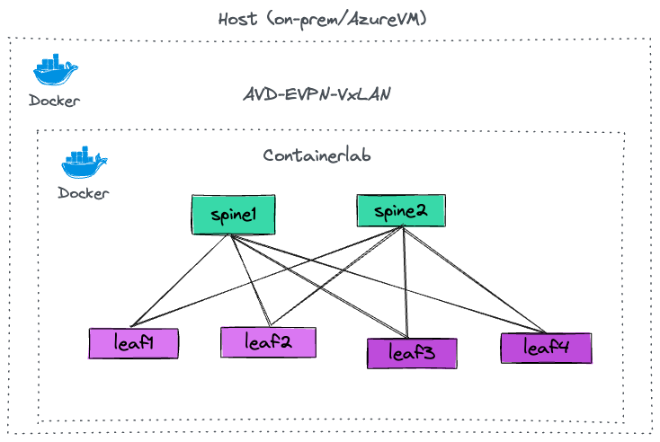

# AVD EVPN-VXLAN Quickstart

> **WARNING**  
> Please read the guide before you start using "AVD EVPN-VXLAN Quickstart" labs are based on AVD & Containerlab". In this project, DinD - Docker in Docker concept is used to run Container docker into base docker image with privileges which can harm your host system, for instance:
>```bash
>docker run --rm -it --privileged \
>			--network host \
>			-v /var/run/docker.sock:/var/run/docker.sock \
>			-v /etc/hosts:/etc/hosts \
>			--pid="host" \
>			-w $(CURRENT_DIR) \
>			-v $(CURRENT_DIR):$(CURRENT_DIR) \
>			$(DOCKER_NAME):latest sudo containerlab deploy (...)\
>```
> Make sure that you understand the consequences of running Containerlab, cEOS-lab and various scripts provided with this repository on your machine. The components of the lab may change your system settings as they will have super user privileges. 

## Getting Started

  - [Overview](#overview)
  - [Lab Requirements](#lab-requirements)
  - [Lab Topology](#lab-topology)
  - [How To Use The Lab](#how-to-use-the-lab)
  - [How To Destroy The Lab](#how-to-destroy-the-lab)

### Overview

The primary goal of this repository is to facilitate the rapid setup ⚡ of EVPN-VxLAN labs using **[Containerlab](https://containerlab.srlinux.dev/)** and cEOS, a containerized version of Arista's EOS software. This setup, which can be brought to life on any machine equipped with Docker, takes only a few minutes.  It serves as a valuable resource for learning, testing various Arista EOS features, and in some cases, even for crafting configurations suitable for production environments, with the exception of hardware-specific features.

The initial lab list provided in this repository is focused on learning and testing **[AVD](https://avd.sh/en/latest/)**.
Some labs can be easily adjusted to your needs using simplified CSV and YAML inputs.

Currently following EVPN-VxLAN labs are available:

- AVD repository to build **EVPN MLAG** network
- AVD repository to build **EVPN ESI Active-Active** network

### Lab Requirements

A machine with Docker CE or Docker Desktop is required.
Following operating systems were tested:

 - The lab is expected to run on any major Linux distribution.
 - Hardware requirements depend on the number of containers deployed. For toplogies  of 10+ cEOS containers 8 vCPUs and 16 GB RAM are recommended.

> **WARNING**: Please make sure that your host has enough resorces. Otherwise Containerlab can enter "frozen" state and require Docker / host restart.

To install Docker on a Linux machine, please check [this guide](https://docs.docker.com/engine/install).


### Lab Topology
The lab setup diagram:




## How To Use The Lab

This section is explaining basic AVD quickstart lab workflow.

1. Clone AVD quickstart repository to your lab host: `git clone https://github.com/marekplaza/evpnvxlan_quickstart.git` Or use your favorite IDE (like VSCode) for that.
2. It is recommended to remove git remote as changes are not supposed to be pushed to the origin: `git remote remove origin`
3. Change to the lab directory: `cd evpnvxlan_quickstart`. IDE should do that for you automatically.
4. Before running the lab it is recommended to create a dedicated git branch for you lab experiments to keep original branch clean.
5. Check makefile help for the list of commands available: `make help`

```bash
[ ApiusLAB 🧪 ] # make
avd_build_eapi                 Build configs and configure switches via eAPI: ansible-playbook playbooks/fabric-deploy-eapi.yml 
avd_snapshot                   Snapshot: ansible-playbook playbooks/snapshot.yml
avd_validate                   Validate states: ansible-playbook playbooks/validate-states.yml
build                          Build docker image
clab_deploy                    Deploy Containerlab
clab_destroy                   Destroy Containerlab
clab_graph                     Build Containerlab graph
clab_inspect                   Inspect Containerlab
clean                          Remove all Containerlab files and directories
help                           Display help message
inventory_evpn_aa              Generate inventory for EVPN AA
inventory_evpn_mlag            Generate inventory for EVPN MLAG
run                            Run docker image
[ ApiusLAB 🧪 ] # 
```

6. 


 - ### Arista cEOS: dockeriazed EOS image

Please remember to download Arista cEOS image and import it to your local docker images repository. You need to have account on arista.com site. The most convient way is to install using... Yes, you are right! We surely use a dockeraized downloader. Firstly, please generate Download Token on your Arista account and export it as env variable `$ARISTA_TOKEN`, then use eos-downlader [eos-downlader](https://github.com/titom73/eos-downloader), as presented below:

```bash
docker run -it -w $(pwd) -v $(pwd):$(pwd) titom73/eos-downloader:dev --token $ARISTA_TOKEN get eos --image-type cEOS64 --release-type M --latest --log-level debug --output ./
🪐 eos-downloader is starting...
    - Image Type: cEOS64
    - Version: None
🔎  Searching file cEOS64-lab-4.30.4M.tar.xz
    -> Found file at /support/download/EOS-USA/Active Releases/4.30/EOS-4.30.4M/cEOS-lab/cEOS64-lab-4.30.4M.tar.xz
💾  Downloading cEOS64-lab-4.30.4M.tar.xz ━━━━━━━━━━━━━━━━━━━━━━━━━━━━━━━━━━━━━━━ 100.0% • 14.7 MB/s • 571.8/571.8 MB • 0:00:43 •
🚀  Running checksum validation
🔎  Searching file cEOS64-lab-4.30.4M.tar.xz.sha512sum
    -> Found file at /support/download/EOS-USA/Active Releases/4.30/EOS-4.30.4M/cEOS-lab/cEOS64-lab-4.30.4M.tar.xz.sha512sum
💾  Downloading cEOS64-lab-4.30.4M.tar.xz.sha512sum ━━━━━━━━━━━━━━━━━━━━━━━━━━━━━━━━━━━━━━ 100.0% • ? • 155/155 bytes • 0:00:00 •
✅  Downloaded file is correct.
✅  processing done !
```

And import it:

```
docker import cEOS64-lab-4.30.4M.tar.xz ceos64:4.30.4M
sha256:488618b63f2c075496655babfea48341045bdfed3871ccd96af1ac38189bab7c
```


7. Use `make build` to build `avd-quickstart:latest` container image. If that was done earlier and the image already exists, you can skip this step. If you are using VSCode devcontainer, VSCode will do that for you automatically.
8. (Optional) If VSCode devcontainer is used, the container will start automatically. Otherwise you can start it manually in the interactive mode by entering `make run`. You can also skip this steps and execute all commands listed below directly on your host. They will run inside a non-interactive container in that case.
9. Build lab inventory with `make inventory_evpn_aa` (EVPN Active-Active scenario) or `make inventory_evpn_mlag` (EVPN MLAG scenario). This will create a directory with all files required to build the lab.
10. Review the inventory generated by AVD quickstart. Optional: you can git commit the changes.
11. Run `make clab_deploy` to build the containerlab. Wait until the deployment will finish.
12. If you are working with `avd-quickstart:latest` container in the interactive mode, you can add aliases to connect to the lab devices quickly: `add_aliases`. This will allow you to connect to any lab device by typing it's short hostname. For example, `leaf1` will SSH to the switch with the corresponding hostname. You can list generated aliases with `alias` command. This can be especially useful on MacOS, as `/etc/hosts` file can not be changed by Containerlab due to system integrity check restrictions.

```bash
[ ApiusLAB 🧪 ] # add_aliases 
[ ApiusLAB 🧪 ] #leaf
leaf1  leaf2  leaf3  leaf4
```

13. If CVP VM is used in the lab, onboard cLab switches with `make onboard`. Once the script behind this shortcut wil finish, devices will appear in the CVP inventory.
14. To build EVPN configuration and deploy it on the lab switches, you can execute corresponding Ansible AVD playbook with `make avd_build_eapi` (deploy directly) or `make avd_build_cvp` (deploy via CVP if it's present in the lab) shortcut. That will execute `playbook/fabric-deploy-eapi.yml` or `playbook/fabric-deploy-cvp.yml` playbooks. If the configuration is delivered via CVP, don't forget to execute the tasks generated by the playbook.
15. Once the configs are deployed, you can SSH to any switch using corresponding alias and type any show commands to check the lab state. Verify that hosts can ping each other.
16. To test Ansible AVD post-validation role, use `make avd_validate`. The playbook itself is located at `playbooks/validate-states.yml`. This will generate corresponding reports in the lab directory.
17. You can also collect as snapshot (series of pre-defined show commands) with `make avd_snapshot`.
18. You can optionally git commit the changes and start playing with the lab. Use CSVs to add some VLANs, etc. for example. Re-generate the inventory and check how the AVD repository data changes.

## How To Clean Up The Lab

1. Execute `make clab_destroy` to destroy the containerlab.
2. Execute `make clean` to delete the generated AVD inventory.

